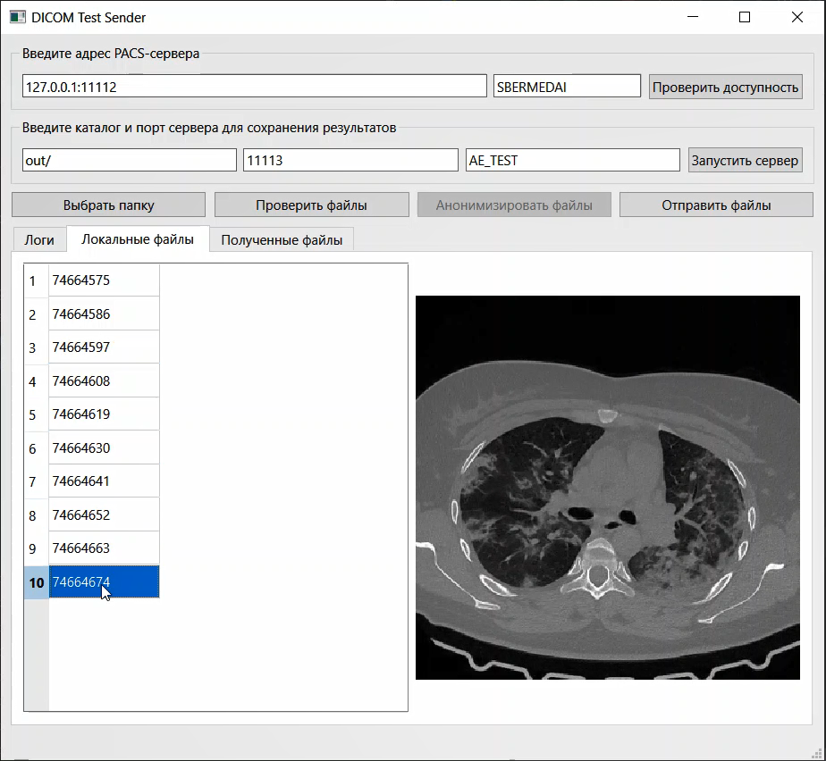

# DICOM Test Sender

Кросплатформенное десктопное приложение для работы с DICOM-файлами (чтение, просмотр тегов, просмотр изображений), отправкой и получением их по локальной сети.

## Возможности
- чтение dicom файлов с исследованиями из каталога
- просмотр тегов и проверка файлов на валидность
- просмотр изображений/снимкой хранящихся в dicom-формате
- отправка файлов на удаленный PACS-сервер (реализация функцию SCU)
- получение файлов по сети (реализация функцию SCP) c последующим сохранением в папку

## Запуск
1. Установить и активирование вирт.окружение Python
```
python -m venv pyside-dicom-sender
pyside-dicom-sender\Scripts\activate
```

2. Установка зависимостей
```
pip install -r requirements.txt
```

3. Запуск приложения
```
python main.py
```

## Работа

1. Редактирование UI
```
pyside-dicom-sender\Scripts\pyside6-designer.exe form.ui
```

2. Компиляция UI
```
pyside-dicom-sender\Scripts\pyside6-uic.exe form.ui > ui_main.py
```

3. Редактирование файла main.py

## Сборка

1. Windows
```
pyside-dicom-sender\Scripts\pyinstaller --windowed --onefile dicom-sender.spec
```
2. MacOS
```
pyinstaller --windowed --onefile --name="dicom-sender-mac" main.py
```
3. Linux

## Дистрибутивы

- Windows - [скачать](https://files.sbermed.ai/s/tESi4tmCERfpmcQ)
- MacOS - 
- Linux - 

## Демонстрация

- [Видео](https://files.sbermed.ai/s/tTH2LQXNt4gCK8p)
- [Видео2 (MacOS)](https://files.sbermed.ai/s/kBAc6WsjwpR75GG)

[](https://files.sbermed.ai/s/tTH2LQXNt4gCK8p)

